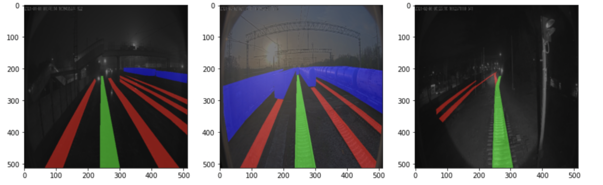

# RZD_segmentation

В рамках чемпионата требовалось создать алгоритм, определяющий элементы дорожной инфраструктуры: колею (рельсошпальную решетку) и подвижной состав (локомотивы, грузовые вагоны, пассажирские вагоны).

Классы :
6 - остальные колеи
7 - главная колея 
10 - вагоны

Обучение проводилось на :
* train/images — папка, содержащая 8203 трехканальных RGB изображений для обучения.
* train/mask — папка, содержащая 8203 масок той же размерности со сегментированной инфраструктурой .
* test/— папка, содержащая 1000 фотографий для классификации;

### Используемые модели
Architectures : FPN 

Encoders ensemble : 
* timm-regnety_032
* efficientnet-b5

